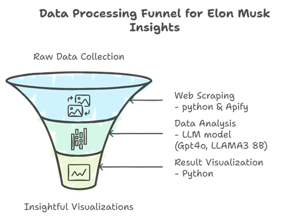

# Elon Musk Sentiment Analysis Project

This repository contains the final project for MGMT4084: Social Media Sentiment Analysis of Elon Musk. The project aims to collect, process, and analyze public sentiment towards Elon Musk using data from Reddit and Google News. The repository includes Python scripts for web scraping and sentiment analysis, as well as visualizations and conclusions drawn from the data.

---

## 📚 **Contents**
1. [Project Overview](#project-overview)
2. [Data Collection](#data-collection)
3. [Tools and Technologies](#tools-and-technologies)
4. [Conclusion](#conclusion)
5. [Recommendations](#recommendations)

---

## 📖 **Project Overview**
This project focuses on analyzing the public perception of Elon Musk across different social media platforms. The analysis period spans from August 30 to November 30, 2024. The data sources include:
- **Reddit**
- **Google News**

The primary hypothesis is: "Sentiments about Elon Musk are mostly neutral across all platforms."

The findings indicate varying sentiments based on the platform used, highlighting different audience behaviors and platform characteristics.

---

## 🛠 **Data Collection**
The data was collected using web scraping techniques from Reddit and Google News. The tools and methods used include:

### Reddit Data Collection
- **Script:** `reddit_scraper.py`
- **Library:** `praw`
- **Functionality:**
  - Fetches top posts and comments from the `elonmusk` subreddit.
  - Retrieves the top 20 comments for each post.
  - Saves data to `reddit_posts_data.csv`.

### News Data Collection
- **Script:** `news_scraper.py`
- **Library:** `feedparser`, `BeautifulSoup`, `newspaper`
- **Functionality:**
  - Extracts news articles about Elon Musk from Google News RSS feed.
  - Filters articles from the past six months.
  - Saves data to `elon_musk_news.csv` and `elon_musk_news_with_content.csv`.

---

## 🧰 **Tools and Technologies**
- **Programming Language:** Python
- **Libraries:**
  - `praw` (Reddit API)
  - `feedparser` (RSS feed parsing)
  - `BeautifulSoup` (HTML parsing)
  - `newspaper` (Article content extraction)
  - `pandas` (Data processing)
  - `tqdm` (Progress bar)
  - `logging` (Script logging)

---


## 📊 **Conclusion**
The sentiment analysis revealed platform-specific variations in how Elon Musk is perceived:
- **Google News**: Sentiments are fairly balanced, with 40% neutral, 33.6% positive, and 26.4% negative.
- **Reddit**: Sentiments are predominantly positive (51.3%), with 37.9% neutral and 10.8% negative.

The analysis indicates that Elon Musk's multifaceted persona results in varied public perceptions based on the nature of the platform.

---

## 📢 **Recommendations**
1. **Proactive Media Engagement:** Engage with media outlets to reduce negative coverage.
2. **Community Engagement:** Increase engagement on platforms like Reddit to strengthen grassroots support.
3. **Strategic Issue Management:** Adopt tailored communication strategies to address different platform audiences.

---

## 📂 **File Structure**
```
├── reddit_scraper.py        # Script to scrape data from Reddit
├── news_scraper.py          # Script to scrape data from Google News
├── elon_musk_news.csv       # News articles data
├── reddit_posts_data.csv    # Reddit posts data
├── flow.png                 # Project flowchart image
├── README.md                # Project documentation
```

---

## 🖼 **Project Flowchart**
Below is a visual representation of the project workflow:



---

## 👨‍💻 **Contributors**
- King To Chung
